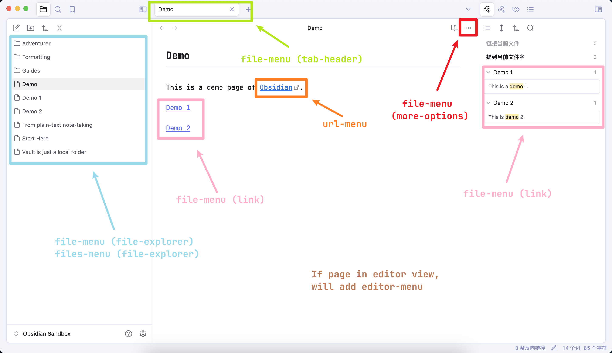

# 🕶️ Obsidian Hide Commands in Menus

This plugin allows you to hide any commands, including those from community plugins.

## Prerequisite

Before using this plugin, ensure you have **disabled "Native menus"** in Obsidian's Appearance settings!

## Features

- Hide different commands across various menus in Obsidian.
- Automatically remove redundant dividers when commands are hidden.
- Inject different CSS classes for menu styling control.
- Use regex pattern matching for advanced rule configurations.

## Installation

There are two ways to install the plugin before it is officially published by Obsidian:

### Install by Downloading Release

1. Download the latest release from the [GitHub releases page](https://github.com/bomian98/obsidian-hide-commands-in-menu/releases).
2. Unzip the zip file into your Obsidian plugins folder (default location: `VaultPath/.obsidian/plugins`).

### Install via BRAT Plugin

1. After installing BRAT plugin, click "Add Beta plugin" in the BRAT settings.
2. Enter the following URL: `https://github.com/bomian98/obsidian-hide-commands-in-menu`.
3. Click "Add Plugin". Wait a few seconds for the plugin to install, and you can use it directly.

## Menu Types

| Menu Type                  | Trigger Location                    |
| -------------------------- | ----------------------------------- |
| file-menu (tab-header)     | Right-click file tab                |
| file-menu (more-options)   | Click workspace ··· button          |
| file-menu (file-explorer)  | Right-click file/folder in explorer |
| file-menu (link)           | Right-click internal link           |
| files-menu (file-explorer) | Right-click multiple explorer items |
| editor-menu                | Right-click in editor view          |
| url-menu                   | Right-click external link           |
| other-menu                 | Any other menu                      |

> **Note**: When in the editor view, right-clicking a link will also trigger either the `url-menu` or `file-menu (link)`.

To examine the displayed menu, utilize Obsidian's Developer Tools to inspect the menu's HTML class.

## Customize Styles

- Select hide-commands: `div.custom-menu-hide-item`
- Select hide-separators: `div.custom-menu-hide-separator`
- Select different menus:

| Menu Type                  | CSS Selector                             |
| -------------------------- | ---------------------------------------- |
| file-menu (tab-header)     | `.file-menu-tab-header`                  |
| file-menu (more-options)   | `.file-menu-more-options`                |
| file-menu (file-explorer)  | `.file-menu-file-explorer-context-menu`  |
| file-menu (link)           | `.file-menu-link-context-menu`           |
| files-menu (file-explorer) | `.files-menu-file-explorer-context-menu` |
| editor-menu                | `.editor-menu`                           |
| url-menu                   | `.url-menu`                              |
| other-menu                 | `[class="menu"]`                         |

## Development Roadmap

- [x] Develop hide commands across multiple menus.
- [x] Hide redundant separators when all enclosed commands are hidden.
- [x] Regex support.
- [ ] Multi-language support.

## Contributing

We welcome contributions! Please feel free to submit issues or pull requests.

## License

This project is licensed under the MIT License. See the [LICENSE](LICENSE) file for details.

## Thanks

This plugin was initially a fork of kzhovn's excellent [obsidian-customizable-menu](https://github.com/kzhovn/obsidian-customizable-menu).

Enjoy a cleaner Obsidian experience! 🚀
